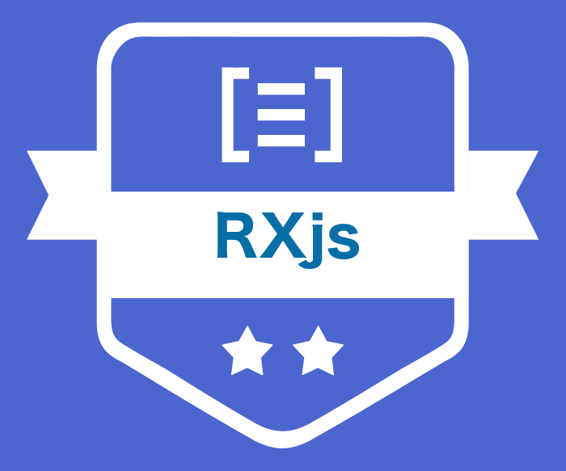

# RXjs

A [SFEIR School](https://www.sfeir.com/formation/school/)

# Slides

You can view the slides [here](https://sfeir-open-source.github.io/sfeir-school-rxjs/).

# Exercises (Not the tchat)

To run exercises, you have to go to "exercises" directory, run `npm install` to init the dependancies.

⚠️ You have to use Node 11+ to execute thoses exercises because some of the function used in javascript require node 11.

## Run exercises (Not the tchat)

To run an exercise, you can first `npm run tsc XXX/FILE.ts` and after `node XXX/FILE.js` or run the script corresponding to exercise:

- `npm run 00`
- `npm run 0-intro`
- `npm run 1-sequences`
- `npm run 2-Observable`
- `npm run 3-RxObservable`

## Solutions

Each directory has a solution.ts file that contains the solution of exercice. You can test it by running `npx jest`

# Exercices (The tchat)

To run the tchat exercices, simply run `npm install` at the root of repository to init the dependancies.

A websocket server will be run on port 3000 and the app is available on port 8080.

`npm start`run the final solution

## Run exercices (The tchat)

To run a step of the exercice, simply run `npm start --step=XXX`

### Steps

Each exercise has two directories:

- a clean directory to get you started (ex: exercice-3)
- a solution directory (ex: exercice-3-solution)

to go to a step run the npm script with --step=XX :

- `npm start --step=exercice-3` for an exercise
- `npm start --step=exercice-3-solution` for the solution
